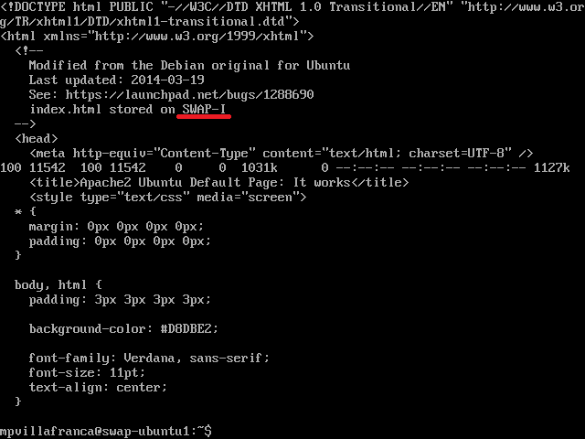
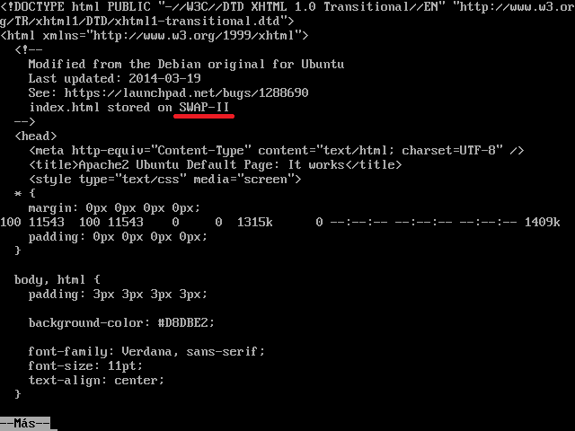

Práctica 3 - Balanceo de carga
==========
*Mariano Palomo Villafranca*

> En esta práctica el objetivo es configurar las máquinas virtuales de forma que dos hagan de servidores web finales mientras que la tercera haga de balanceador de carga por software.

###Ejercicio 1: Configurar una máquina e instalarle nginx como balanceador de carga

En primer lugar, instalaremos nginx en nuestra máquina balanceadora, la cual no debe tener instalado Apache, pues éste se apropia del puerto 80. Para ello, realizamos lo siguiente:

	cd /tmp/
	wget http://nginx.org/keys/nginx_signing.key
	apt-key add /tmp/nginx_signing.key
	rm -f /tmp/nginx_signing.key

	echo "deb http://nginx.org/packages/ubuntu/ lucid nginx" >> /etc/apt/sources.list
	echo "deb-src http://nginx.org/packages/ubuntu/ lucid nginx" >> /etc/apt/sources.list

	apt-get update
	apt-get install nginx

Una vez instalado, debemos editar la configuración de nginx:

>Fichero */etc/nginx/conf.d/default.conf*

	upstream apaches {
		server 192.168.10.101;
		server 192.168.10.102;
	}

	server{
		listen 80;
		server_name m3lb;

		access_log /var/log/nginx/m3lb.access.log;
		error_log /var/log/nginx/m3lb.error.log;
		root /var/www/;

		location /
		{
			proxy_pass http://apaches;
			proxy_set_header Host $host;
			proxy_set_header X-Real-IP $remote_addr;
			proxy_set_header X-Forwarded-For $proxy_add_x_forwarded_for;
			proxy_http_version 1.1;
			proxy_set_header Connection "";
		}
	}

Reiniciamos el servicio con:

	sudo service nginx restart
	
Con esto, hemos usado balanceo mediante el algoritmo de round-robin con la misma prioridad para todos los servidores. Ahora, realizamos peticiones a la dirección IP principal y comprobamos que realmente se reparte la carga. Para ello ejecutamos:

>Petición 1

	curl http://192.168.10.103
	

  

>Petición 2

	curl http://192.168.10.103
  

Y, efectivamente, como se muestra en la captura de pantalla, se realiza alternativamente entre la máquina 1 y 2 el reparto (para ello hemos identificado cada una de las máquinas en el *index.html* correspondiente).

Además de los utilizados, se pueden tener en cuenta los siguientes parámetros:

|:-:|:-|
|**weight = NUMBER**|Permite especificar un peso para el servidor (por defecto es 1).
|**max_fails = NUMBER**|Especifica un número de intentos de comunicación erróneos en "fail_timeout" segundos para considerar al servidor no operativo (por defecto es 1, un valor de 0 lo desactivaría).|
|**fail_timeout = TIME**|Indica el tiempo en el que deben ocurrir "max_fails" intentos fallidos de conexión para considerar al servidor no operativo. Por defecto es 10 segundos.|
|**down**|Marca el servidor como permanentemente offline (para ser usado con ip_hash).|
|**backup**|Reserva este servidor y sólo le pasa tráfico si alguno de los otros servidores nobackup está caído u ocupado. No es compatible con la directiva ip_hash|

> **NOTA 1**: Nos interesará que las peticiones que vengan de una misma dirección IP sean atendidas por la misma máquina servidora final con el fin de evitar errores referentes a la sesión del usuario. Para ello utilizamos *ip_hash;*

> **NOTA 2**: la desventaja de *ip_hash;* es que los usuarios detrás de un proxy o NAT serán dirigidos al mismo backend, por lo que podemos encontrarnos con un balanceo poco equilibrado. Para evitarlo, si disponemos de la versión de nginx 1.2 o superior, podemos utilizar conexiones keepalive entre nginx y servidor final añadiendo *keepalive 3;* para mantener la sesión durante 3 segundos, por ejemplo.

Se nos pide ahora, comprobar el funcionamiento de los algoritmos de balanceo con ponderación (en este caso, suponiendo que la máquina 1 tiene el doble de
capacidad que la máquina 2), resultando la siguiente configuración:

	upstream apaches {
		server 172.16.168.130 weight=2;
		server 172.16.168.131 weight=1;
	}

Reiniciamos el servicio y comprobamos que se aplica la configuración establecida del mismo modo que antes.

###Ejercicio 2: Configurar una máquina e instalarle el haproxy como balanceador de carga
En primer lugar, detenemos el servicio *nginx* con:
	
	sudo service nginx stop
A continuación procedemos a instalar haproxy:

	sudo apt-get install haproxy
Una vez instalado, debemos modificar el archivo /etc/haproxy/haproxy.cfg ya que
la configuración que trae por defecto no nos vale. Así pues, tomando las IPs de las máquinas servidoras y la máquina balanceadora anteriores, editamos el
fichero de configuración de haproxy:

	cd /etc/haproxy/
	sudo nano haproxy.cfg

Usemos como configuración inicial la siguiente:

	global
		daemon
		maxconn 256
	defaults
		mode http
		contimeout 4000
		clitimeout 42000
		srvtimeout 43000
	frontend http-in
		bind *:80
		default_backend servers
	backend servers
		server m1 192.168.10.101:80 maxconn 32
		server m2 192.168.10.102:80 maxconn 32

Lanzamos el servicio con:
	
	sudo /usr/sbin/haproxy -f /etc/haproxy/haproxy.cfg

No obtenemos ningún error ni aviso, por lo que todo ha ido bien y, ahora, por último, comprobamos que el balanceador reparte la carga alternativamente, del mismo modo que antes:

	curl http://192.168.10.103
	curl http://192.168.10.103