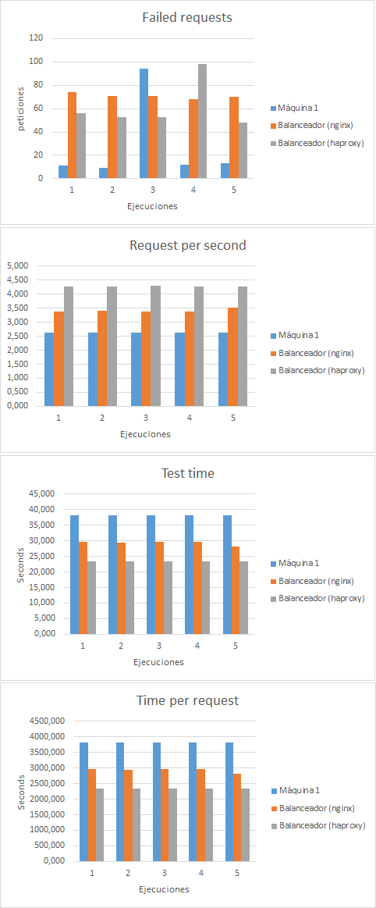
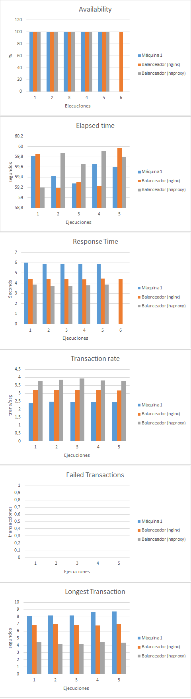

Práctica 4: Comprobar el rendimiento de servidores web
==========
*Mariano Palomo Villafranca*

> En esta práctica el objetivo es medir el rendimiento de nuestro servidor. Para ello, usaremos, al menos, tres herramientas para medir, primero el rendimiento de una sola máquina servidora (haciendo peticiones a la IP de la máquina 1), y a continuación el de la granja web con balanceo de carga (haciendo las peticiones a la dirección IP del balanceador).

En la práctica anterior, se hizo uso de dos programas diferentes para hacer el balanceo, por lo que, en esta práctica, comprobaremos el rendimiento de la granja web cuando el balanceador es nginx y también cuando es haproxy.

Para ello, se hará un mímimo de 10 peticiones para obtener media y desviación estándar y se mostrarán los resultados en forma de tabla y gráficas.

Además, como cuestión opcional, se plantea buscar otra herramienta para medir las prestaciones y utilizarla tanto con la máquina individual como con la granja web.

####Configuración y direcciones IP
-  Máquina 1: 192.168.10.101
-  Máquina 2: 192.168.10.102
-  Máquina 3 (Balanceador): 192.168.10.103
-  Máquina 4 (Benchmarks): 192.168.10.104 

###Ejercicio 1: Comprobar el rendimiento de servidores web con Apache Benchmark

Apache Benchmark (*ab*) es una herramienta creada por Apache que nos permite comprobar el rendimiento de un servidor web, ya sea del hardware o software, o de alguna modificación que le hayamos hecho. Sin embargo, *ab* no simula con fidelidad el uso del sitio web que pueden hacer los usuarios habitualmente pues pide el mismo recurso (misma página repetidamente. Por tanto, las medidas obtenidas con *ab* sólo dan una idea
aproximada del rendimiento del sitio, pero no reflejan el rendimiento real.

En primer lugar, crearemos una página HTML con un script PHP y la colocaremos en el directorio
correspondiente al espacio web de los servidores finales, identificando a cada máquina.
>*index.php* alojada en *var/www/html*
	
  

Ahora accedemos a un terminal en la máquina independiente del resto de la granja
web y tecleamos el siguiente comando para comprobar que todo funciona correctamente:

	ab -n 1000 -c 5 http://192.168.10.101/index.php

donde ***-n 1000*** hace que se solicite mil veces esta página y ***-c 5*** hace que se pidan concurrentemente de cinco en cinco.

Una vez realizado esto, pasamos a realizar los benchmarks con `ab`. Para ello, se han creado dos pequeños [scripts](ab/scripts/) que lanzan los benchmarks contra la máquina servidora 1 (maquina1) y el balanceador de carga. Puesto que en la práctica anterior usamos dos programas diferentes para hacer el balanceo, en esta práctica comprobaremos el rendimiento de la granja web cuando el balanceador es nginx y también cuando es haproxy. De este modo, obtenemos los siguientes resultados:

<table>
  <tr>
    <th colspan="2">Resultados obtenidos con Apache Benchmark</th>
    <th>1</th>
    <th>2</th>
    <th>3</th>
    <th>4</th>
    <th>5</th>
    <th>Media</th>
    <th>Desviación</th>
  </tr>
  <tr>
    <td rowspan="4">Máquina 1</td>
    <td>Failed Requests</td>
    <td>11</td>
    <td>9</td>
    <td>94</td>
    <td>12</td>
    <td>13</td>
    <td>27,8</td>
    <td>37,0364685</td>
  </tr>
  <tr>
    <td>Requests per second</td>
    <td>2,620</td>
    <td>2,620</td>
    <td>2,620</td>
    <td>2,620</td>
    <td>2,620</td>
    <td>2,62</td>
    <td>0</td>
  </tr>
  <tr>
    <td>Test Time</td>
    <td>38,199</td>
    <td>38,190</td>
    <td>38,212</td>
    <td>38,144</td>
    <td>38,189</td>
    <td>38,1868</td>
    <td>0,02564566</td>
  </tr>
  <tr>
    <td>Time per request</td>
    <td>3819,879</td>
    <td>3818,969</td>
    <td>3821,210</td>
    <td>3814,357</td>
    <td>3818,904</td>
    <td>3818,6638</td>
    <td>2,58162811</td>
  </tr>
  <tr>
    <td rowspan="4">Balanceador (nginx)</td>
    <td>Failed Requests</td>
    <td>74</td>
    <td>71</td>
    <td>71</td>
    <td>68</td>
    <td>70</td>
    <td>70,8</td>
    <td>2,16794834</td>
  </tr>
  <tr>
    <td>Requests per second</td>
    <td>3,370</td>
    <td>3,410</td>
    <td>3,380</td>
    <td>3,370</td>
    <td>3,530</td>
    <td>3,412</td>
    <td>0,06797058</td>
  </tr>
  <tr>
    <td>Test Time</td>
    <td>29,658</td>
    <td>29,319</td>
    <td>29,583</td>
    <td>29,692</td>
    <td>28,293</td>
    <td>29,309</td>
    <td>0,58649851</td>
  </tr>
  <tr>
    <td>Time per request</td>
    <td>2965,753</td>
    <td>2931,933</td>
    <td>2958,329</td>
    <td>2969,209</td>
    <td>2829,284</td>
    <td>2930,9016</td>
    <td>58,6547945</td>
  </tr>
  <tr>
    <td rowspan="4">Balanceador (haproxy)</td>
    <td>Failed Requests</td>
    <td>56</td>
    <td>53</td>
    <td>53</td>
    <td>98</td>
    <td>48</td>
    <td>61,6</td>
    <td>20,5499392</td>
  </tr>
  <tr>
    <td>Requests per second</td>
    <td>4,280</td>
    <td>4,280</td>
    <td>4,290</td>
    <td>4,270</td>
    <td>4,280</td>
    <td>4,28</td>
    <td>0,00707107</td>
  </tr>
  <tr>
    <td>Test Time</td>
    <td>23,364</td>
    <td>23,347</td>
    <td>23,299</td>
    <td>23,405</td>
    <td>23,379</td>
    <td>23,3588</td>
    <td>0,03963837</td>
  </tr>
  <tr>
    <td>Time per request</td>
    <td>2336,410</td>
    <td>2334,732</td>
    <td>2329,872</td>
    <td>2340,470</td>
    <td>2337,947</td>
    <td>2335,8862</td>
    <td>3,96973755</td>
  </tr>
</table>

Por último, mostramos estos datos en forma de gráfica:

  

###Ejercicio 2: Comprobar el rendimiento con Siege
Siege es una herramienta de generación de carga HTTP para benchmarking. Se trata de una utilidad de línea de comandos, similar en interfaz al Apache Benchmark, aunque las opciones de ejecución son ligeramente diferentes. Por ejemplo, permite realizar las baterías de tests contra varias URLs diferentes del mismo servidor, en lugar de usar la misma URL siempre.

Disponemos de varios modos de ejecución. Si usamos la opción `-b` ejecutaremos los tests sin pausas con lo que comprobaremos el rendimiento general. Sin la opción `-b` la herramienta inserta un segundo de pausa entre las diferentes peticiones para cada usuario simulado. Además, podemos indicar el tiempo exacto que queremos ejecutar Siege. Para ello, usaremos la opción `-t` siguiendo el siguiente formato:

- `-t60S` (60 segundos)
- `-t1H` (1 hora)
- `-t120M` (120 minutos)

Siege usará 15 usuarios concurrentes (el valor por defecto) y estará en ejecución durante el tiempo que le indiquemos. Para obtener los resultados de nuestro benchmark utilizaremos: 

	# Para el servidor "máquina 1"
	siege -b -t60S -v http://192.168.10.101/index.php	

	# Para la granja web
	siege -b -t60S -v http://192.168.10.103/index.php

Tras la ejecución de los comandos, y probando el rendimiento del servidor web lanzando peticiones al balanceador tanto con nginx como con haproxy, obtenemos los siguientes resultados:

Expresamos dichos resultados en forma de gráficas:

<table>
  <tr>
    <th colspan="2">Resultados obtenidos con Siege</th>
    <th>1</th>
    <th>2</th>
    <th>3</th>
    <th>4</th>
    <th>5</th>
    <th>Media</th>
    <th>Desviación</th>
  </tr>
  <tr>
    <td rowspan="6">Máquina 1</td>
    <td>Availability</td>
    <td>100</td>
    <td>100</td>
    <td>100</td>
    <td>100</td>
    <td>100</td>
    <td>100</td>
    <td>0</td>
  </tr>
  <tr>
    <td>Elapsed time</td>
    <td>59,81</td>
    <td>59,42</td>
    <td>59,28</td>
    <td>59,66</td>
    <td>59,6</td>
    <td>59,554</td>
    <td>0,18542923</td>
  </tr>
  <tr>
    <td>Response time</td>
    <td>6,02</td>
    <td>5,84</td>
    <td>5,88</td>
    <td>5,86</td>
    <td>5,86</td>
    <td>5,892</td>
    <td>0,06523803</td>
  </tr>
  <tr>
    <td>Transaction rate</td>
    <td>2,39</td>
    <td>2,47</td>
    <td>2,46</td>
    <td>2,45</td>
    <td>2,45</td>
    <td>2,444</td>
    <td>0,028</td>
  </tr>
  <tr>
    <td>Failed transactions</td>
    <td>0</td>
    <td>0</td>
    <td>0</td>
    <td>0</td>
    <td>0</td>
    <td>0</td>
    <td>0</td>
  </tr>
  <tr>
    <td>Longest transaction</td>
    <td>8,1</td>
    <td>8,15</td>
    <td>8,17</td>
    <td>8,68</td>
    <td>8,76</td>
    <td>8,372</td>
    <td>0,28617477</td>
  </tr>
  <tr>
    <td rowspan="6">Balanceador (nginx)</td>
    <td>Availability</td>
    <td>100</td>
    <td>100</td>
    <td>100</td>
    <td>100</td>
    <td>100</td>
    <td>100</td>
    <td>0</td>
  </tr>
  <tr>
    <td>Elapsed time</td>
    <td>59,85</td>
    <td>59,19</td>
    <td>59,31</td>
    <td>59,23</td>
    <td>59,97</td>
    <td>59,51</td>
    <td>0,33105891</td>
  </tr>
  <tr>
    <td>Response time</td>
    <td>4,42</td>
    <td>4,4</td>
    <td>4,41</td>
    <td>4,38</td>
    <td>4,46</td>
    <td>4,414</td>
    <td>0,026533</td>
  </tr>
  <tr>
    <td>Transaction rate</td>
    <td>3,19</td>
    <td>3,21</td>
    <td>3,2</td>
    <td>3,21</td>
    <td>3,17</td>
    <td>3,196</td>
    <td>0,01496663</td>
  </tr>
  <tr>
    <td>Failed transactions</td>
    <td>0</td>
    <td>0</td>
    <td>0</td>
    <td>0</td>
    <td>0</td>
    <td>0</td>
    <td>0</td>
  </tr>
  <tr>
    <td>Longest transaction</td>
    <td>6,83</td>
    <td>6,93</td>
    <td>6,86</td>
    <td>6,76</td>
    <td>6,97</td>
    <td>6,87</td>
    <td>0,07402702</td>
  </tr>
  <tr>
    <td rowspan="6">Balanceador (haproxy)</td>
    <td>Availability</td>
    <td>100</td>
    <td>100</td>
    <td>100</td>
    <td>100</td>
    <td>100</td>
    <td>100</td>
    <td>0</td>
  </tr>
  <tr>
    <td>Elapsed time</td>
    <td>59,2</td>
    <td>59,87</td>
    <td>59,65</td>
    <td>59,91</td>
    <td>59,79</td>
    <td>59,684</td>
    <td>0,25780613</td>
  </tr>
  <tr>
    <td>Response time</td>
    <td>3,85</td>
    <td>3,74</td>
    <td>3,72</td>
    <td>3,8</td>
    <td>3,86</td>
    <td>3,794</td>
    <td>0,05642694</td>
  </tr>
  <tr>
    <td>Transaction rate</td>
    <td>3,77</td>
    <td>3,86</td>
    <td>3,92</td>
    <td>3,81</td>
    <td>3,75</td>
    <td>3,822</td>
    <td>0,06177378</td>
  </tr>
  <tr>
    <td>Failed transactions</td>
    <td>0</td>
    <td>0</td>
    <td>0</td>
    <td>0</td>
    <td>0</td>
    <td>0</td>
    <td>0</td>
  </tr>
  <tr>
    <td>Longest transaction</td>
    <td>4,52</td>
    <td>4,24</td>
    <td>4,2</td>
    <td>4,51</td>
    <td>4,41</td>
    <td>4,376</td>
    <td>0,13365628</td>
  </tr>
</table>

  

##Problemas encontrados y solución
* **Valores más fieles en la ejecución de los benchmarks**: tras observar valores un tanto extraños en las primeras ejecuciones de los benchmarks, se desabilitó la conexión a internet del equipo host. A partir de entonces, los resultados mejoraron considerablemente (de un 70% a un 100% de disponibilidad), tal y como se muestran en el documento.
