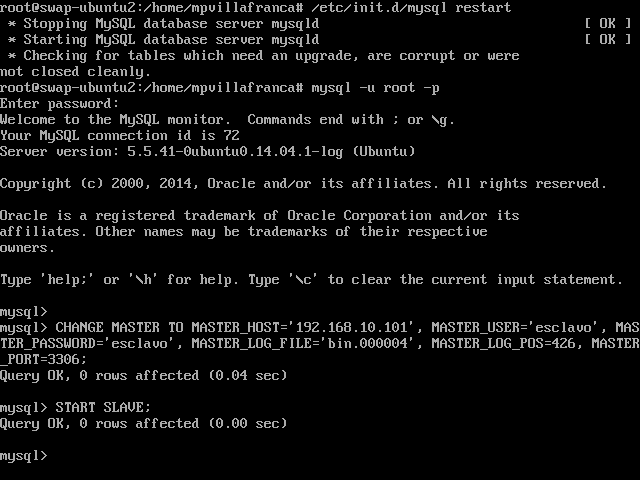

Práctica 5: Replicación de bases de datos MySQL
==========
*Mariano Palomo Villafranca*

> En esta práctica el objetivo es configurar las máquinas virtuales para trabajar de forma que se mantenga actualizada la información en una BD entre dos servidores (la máquina secundaria mantendrá siempre actualizada la información que hay en la máquina servidora principal).

Tareas a realizar:

- Crear una BD con al menos una tabla y algunos datos.
- Realizar la copia de seguridad de la BD completa usando mysqldump.
- Restaurar dicha copia en la segunda máquina (clonado manual de la BD).
- Realizar la configuración maestro-esclavo de los servidores MySQL para que la replicación de datos se realice automáticamente.

###Ejercicio 1: Crear una BD e insertar datos
En primero lugar, accedemos a `mysql` en la *máquina1* con el comando:

	mysql -uroot -p

Tras esto, introducimos la contraseña y procedemos a crear una base de datos (BD), una tabla en dicha BD e insertar algunos datos.

<pre>
<b>mysql></b> create database contactos;
<b>mysql></b> use contactos;
<b>mysql></b> show tables;
<b>mysql></b> create table datos(nombre varchar(100),tlf int);
<b>mysql></b> insert into datos(nombre,tlf) value ("pepe",95834967);
</pre>

Realizamos algunas consultas:

  

###Ejercicio 2: Replicar una BD MySQL con `mysqldump`
`mysqldump es parte de los programas de cliente MySQL y puede ser utilizado para generar copias de seguridad de DB.

Antes de realizar la copia, debemos evitar que se acceda a la BD para cambiar nada. Para ello, en el servidor de BD principal (máquina 1) hacemos:
	
<pre>
mysql -u root -p
<b>mysql></b> FLUSH TABLES WITH READ LOCK;
<b>mysql></b> quit
</pre>

Ahora ya podemos hacer el `mysqldump`:

	mysqldump contactos -u root -p > /root/ejemplodb.sql

Como habíamos bloqueado las tablas, ahora las desbloqueamos con:

<pre>
mysql -u root -p
<b>mysql></b> UNLOCK TABLES;
<b>mysql></b> quit
</pre>

  

Ahora vamos a la máquina esclavo (máquina 2, secundaria) y copiamos el archivo `.sql` con todos los datos salvados desde la máquina principal.

	scp root@192.168.10.101:/root/ejemplodb.sql /root/

Sin embargo, mysqldump no incluye en el archivo la orden para crear la BD en la máquina secundaria, por lo que debemos crearla nosotros.

<pre>
mysql -u root -p
<b>mysql></b> CREATE DATABASE `contactos`;
<b>mysql></b> quit
</pre>

Y, a continuación, restauramos los datos contenidos en la BD.

	mysql -u root -p contactos < /root/ejemplodb.sql

  

###Ejercicio 3: Replicación de BD mediante una configuración maestro-esclavo
Como hemos podido observar, la opción anterior es algo que un operador tendría que realizar a mano, por lo que se MySQL tiene la opción de configurar el demonio para hacer replicación de BD sobre un esclavo a partir de los datos que almacena el maestro. Esto implica realizar algunas configuraciones en ambas máquinas. 

Lo primero será la configuración del maestro (máquina 1). Accedemos como root a `/etc/mysql/my.cnf` y lo editamos como sigue:

1. Comentar el parámetro bind-adress:
	
		#bind-address 127.0.0.1
2. Indicamos dónde almacenamos el log de errores (ya viene activado)

		log_error = /var/log/mysql/error.log
3. Descomentar para establecer el identificador del servidor.

		server-id = 1
4. El registro binario contiene toda la información que está disponible en el registro de actualizaciones, en un formato más eficiente y de una manera que es segura para las transacciones. Descomentamos dicha línea:

		log_bin = /var/log/mysql/bin.log
5. Guardamos el documento y reiniciamos el servicio. En mi caso, ha sido necesario reiniciar el sistema también.

		/etc/init.d/mysql restart

Comprobamos que todo ha ido correctamente y pasamos a la configuración del esclavo, editando el mismo fichero pero ahora en la máquina 2:

1. Realizamos las mismas modificaciones que antes, sin embargo, ahora, indicamos:

		server-id = 2
2. Reiniciamos el servicio

		/etc/init.d/mysql restart

Entramos en mysql en el **maestro** y realizamos lo siguiente:

<pre>
mysql -u root -p
<b>mysql></b> CREATE USER esclavo IDENTIFIED BY 'esclavo';
<b>mysql></b> GRANT REPLICATION SLAVE ON *.* TO 'esclavo'@'%' IDENTIFIED BY 'esclavo';
<b>mysql></b> FLUSH PRIVILEGES;
<b>mysql></b> FLUSH TABLES;
<b>mysql></b> FLUSH TABLES WITH READ LOCK;
</pre>

  
	
Y ahora en el **cliente**, a partir de la información obtenida de ejecutar en el maestro **`SHOW MASTER STATUS;`**

<pre>
mysql -u root -p
<b>mysql></b> CHANGE MASTER TO MASTER_HOST='192.168.10.101', MASTER_USER='esclavo', MASTER_PASSWORD='esclavo', MASTER_LOG_FILE='bin.000004', MASTER_LOG_POS=426, MASTER_PORT=3306;
<b>mysql></b> START SLAVE;
</pre>

  

Una vez hecho todo esto, podemos hacer pruebas en el maestro y deberían replicarse en el esclavo automáticamente.

Por último, volvemos al maestro y volvemos a activar las tablas para que puedan meterse nuevos datos en el maestro:

<pre>
mysql -u root -p
<b>mysql></b> UNLOCK TABLES;
</pre>

Ahora, si queremos asegurarnos de que todo funciona perfectamente y que el esclavo no tiene ningún problema para replicar la información, nos vamos al esclavo y ejecutamos:

<pre>
mysql -u root -p
<b>mysql></b> SHOW SLAVE STATUS\G
</pre>

Y como vemos, el valor de la variable "Seconds_Behind_Master" es distinto de *null*, por lo que todo está funcionando correctamente.

  

Para finalizar, introducimos algunos datos en el maestro y comprobamos como se actualizan en el esclavo.

  