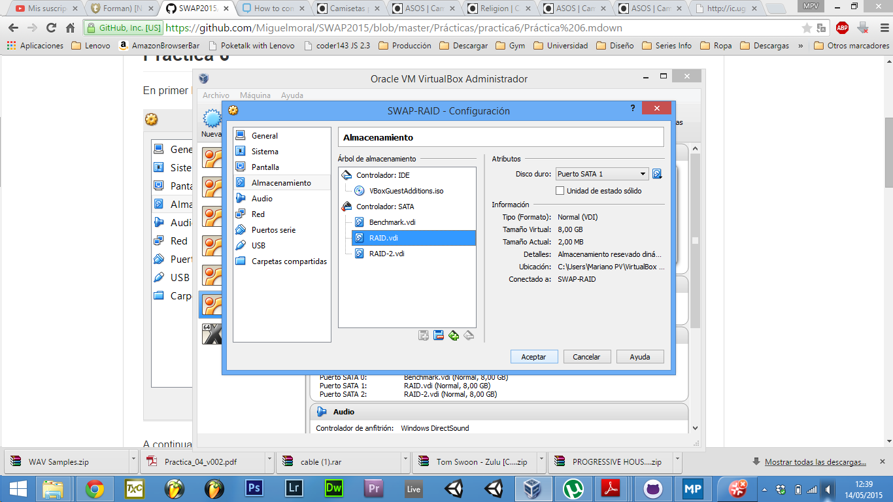
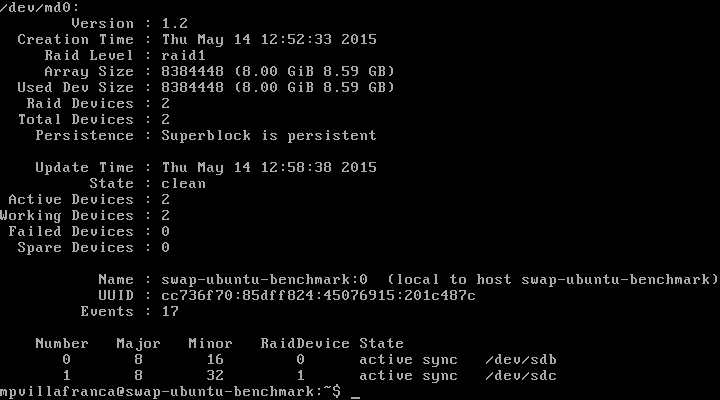
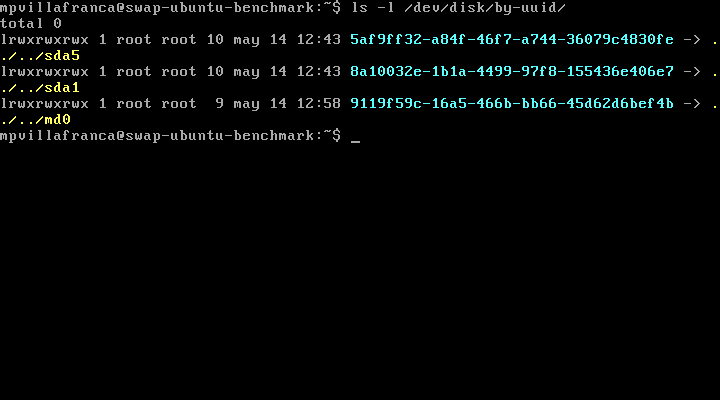
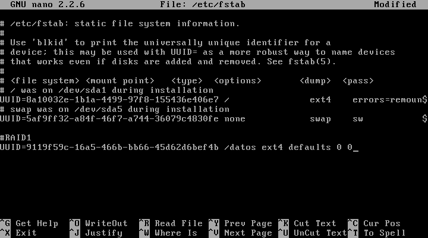

Práctica 6: Discos en RAID
==========
*Mariano Palomo Villafranca*

> El objetivo de esta práctica es configurar varios discos en RAID 1.

Tareas a realizar:

- Configuración de dos discos en RAID bajo Ubuntu Server automatizando el montaje del dispositivo creado al inico del sistema
- Opcionalmente, simular un fallo en uno de los discos del RAID (mediante `mdadm`, retirarlo, comprobar que se puede acceder a la información y, por último, volver a conectarlo.

###Ejercicio 1: Configuración del RAID por software

Partimos de una máquina virtual instalada y configurada a la que, estando apagada, añadimos dos discos de mismo tipo y capacidad.

  

Arrancamos la máquina e instalamos el software necesario para configurar el RAID:

	sudo apt-get install mdadm

Debemos buscar la información (id asignado por Linux) de ambos discos:

	sudo fdisk -l;

Ahora ya podemos crear el RAID 1, usando el dispositivo /dev/md0, indicando el número de dispositivos a utilizar (2), así como su ubicación:

	sudo mdadm -C /dev/md0 --level=raid1 --raid-devices=2 /dev/sdb /dev/sdc

Una vez creado el dispositivo RAID, le damos formato:

	sudo mkfs /dev/md0

Ahora ya podemos crear el directorio en el que se montará la unidad del RAID:

	sudo mkdir /datos
	sudo mount /dev/md0 /datos

Para comprobar el estado del RAID, ejecutamos:

	sudo mdadm --detail /dev/md0

  

Por último, conviene configurar el sistema para que monte el dispositivo RAID creado al arrancar el sistema. Para ello editamos el archivo `/etc/fstab` y añadir la línea correspondiente para montar automáticamente dicho dispositivo. Para ello, en primer lugar, anotamos el UUID del dispositivo tras ejecutar el comando:

	ls -l /dev/disk/by-uuid/

  

Y ahora, editamos el fichero:

  

Tras reiniciar comprobamos que el dispositivo ha pasado de md0 a md127.